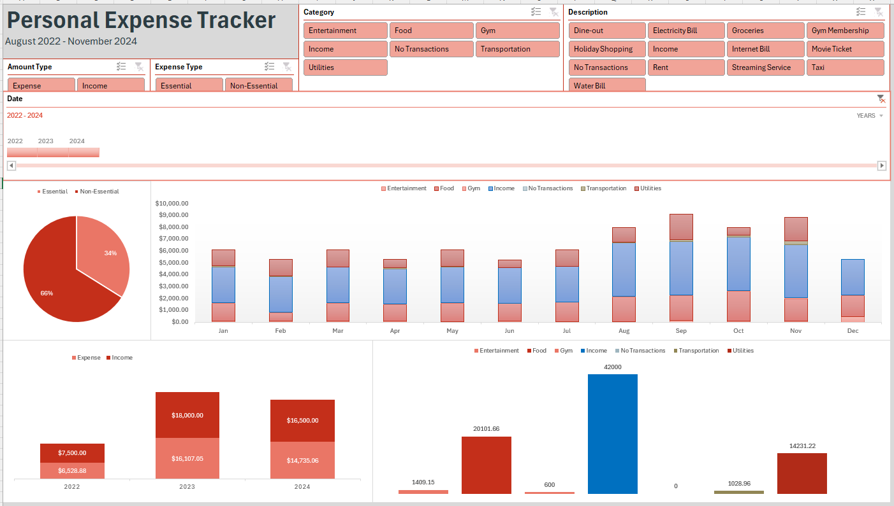

# Income and Utilities Expense Tracker Dashboard

## Overview

This Excel dashboard provides a comprehensive view of personal income and utility expenses, enabling you to monitor financial patterns and improve budget management. It’s designed to help users track and analyze income sources against utility costs for better financial planning.

## Features

- **Income Analysis**: View monthly and annual income summaries to spot trends and project future earnings.
- **Expense Breakdown**: Visualize utility expenses by category (electricity, water, internet) to understand spending patterns.
- **Interactive Graphs**: Track data trends over time with dynamic charts and graphs, making it easier to analyze changes.

## Files

- [Dashboard Image](./Dashboard.png) - A preview of the dashboard interface.
- [Income and Utilities Expense Tracker Excel File](./income_and_utilities_expense_tracker.xlsx) - The Excel file containing the income and expense tracker.

---
